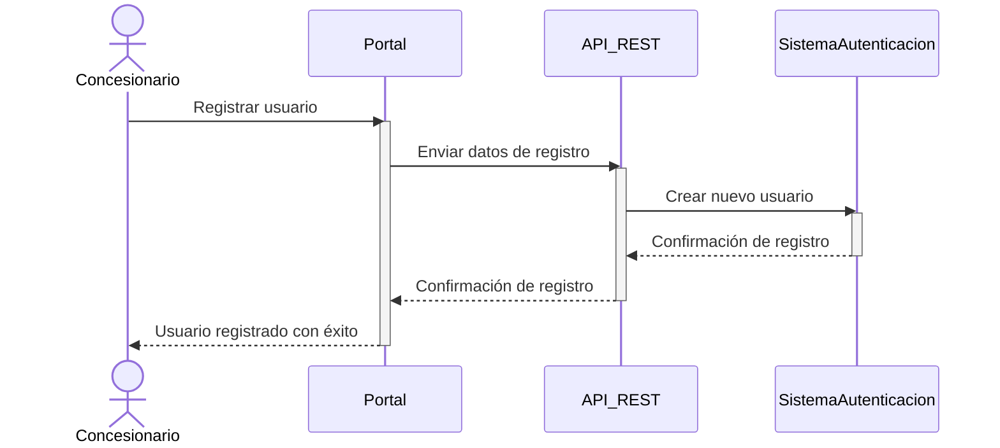
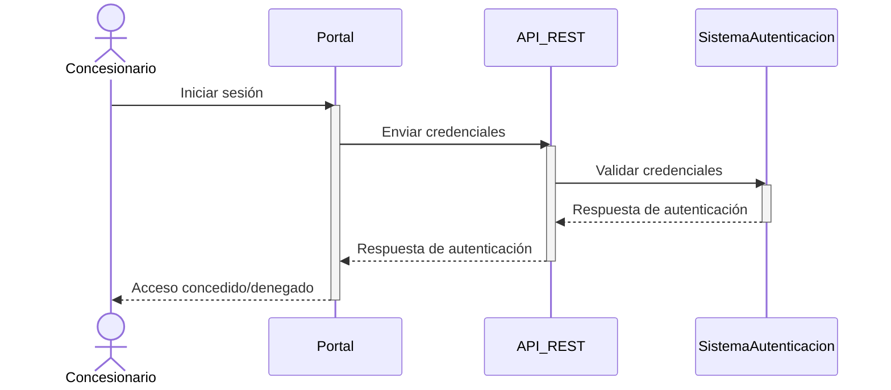
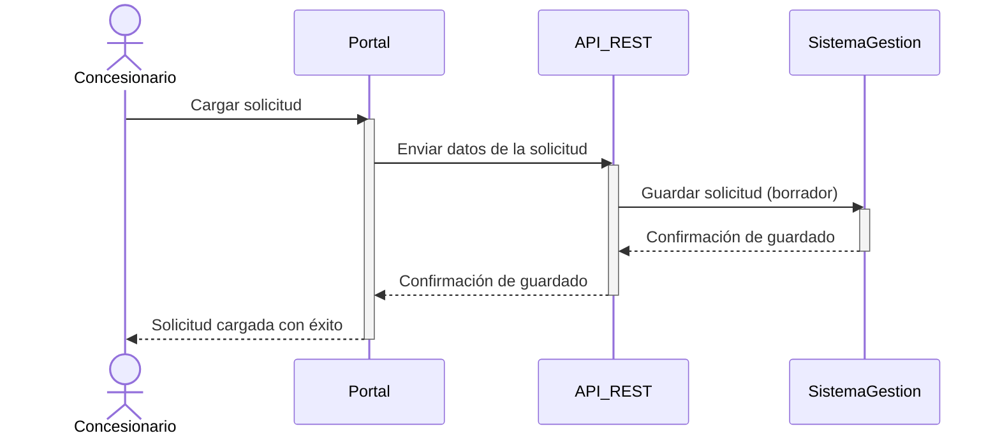
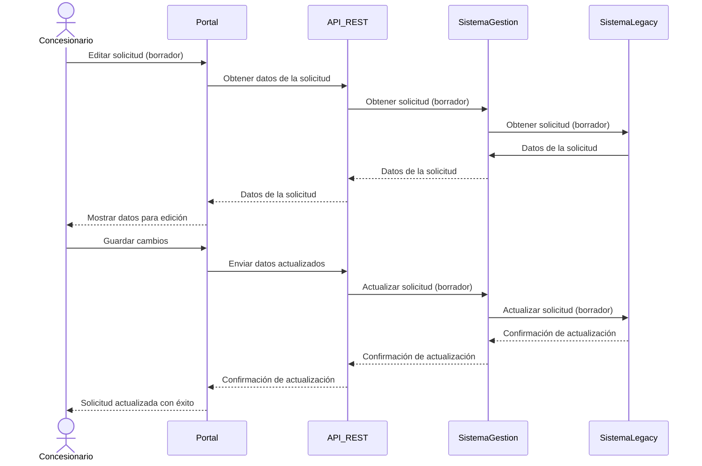
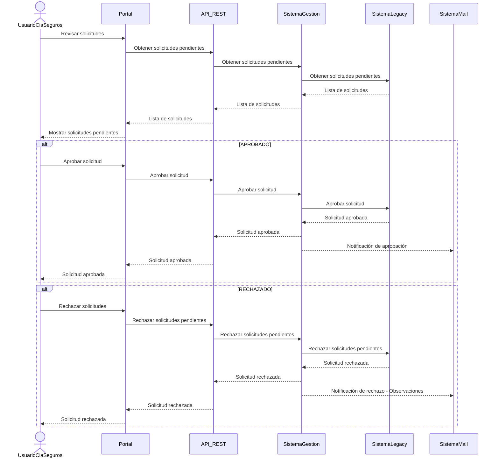
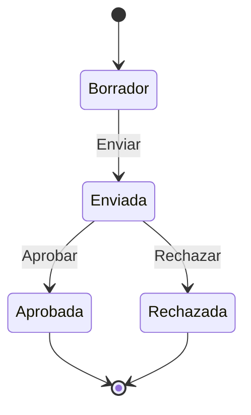

# Alta de Pólizas
Una empresa de seguros tiene un acuerdo con varias concesionarias agrícolas para asegurar la maquinaria adquirida en las mismas.

Actualmente el personal de las concesionarias envía la documentación vía correo electrónico, firmada digitalmente. Posteriormente, el personal de la empresa de seguros recibe esta información, la ingresa manualmente en el sistema, realiza validaciones, y luego informa a la concesionaria, también por correo electrónico, el número de póliza o si se requiere completar información adicional o enviar más documentación de respaldo.

La empresa desea reemplazar este proceso manual por un Portal de Concesionarios que permita la autogestión del alta de pólizas y la automatización del control. Este portal será utilizado por los concesionarios para cargar la información y seguimiento de las pólizas de manera más eficiente.

## Requisitos del Sistema
El equipo de seguridad informática y riesgos ha establecido las siguientes condiciones para el nuevo sistema:

Implementar HTTPS: El portal debe utilizar protocolos de seguridad (HTTPS) para garantizar la privacidad de la información.

Autenticación y autorización: Los usuarios deben autenticarse y tener permisos adecuados para realizar operaciones según su rol.

Acceso restringido: El nuevo portal no debe tener acceso directo a las tablas del sistema interno de pólizas. Se busca minimizar los riesgos de seguridad y accesos no autorizados.

Carga en “borrador”: Los usuarios deben tener la posibilidad de guardar las solicitudes de póliza como "borrador" y editarlas en varias sesiones, antes de enviarlas para su aprobación definitiva.

Eliminación de doble carga: El personal de la empresa de seguros debe poder revisar, aprobar o rechazar las solicitudes de pólizas, sin necesidad de volver a cargar los datos en el sistema legacy.

Aprobación de pólizas: Cuando se aprueba una solicitud, se genera automáticamente una póliza en el sistema legacy, y la solicitud cambia su estado a “Aprobada”.

Rechazo de pólizas: Si se rechaza una solicitud, se cambia el estado a “Rechazada” y se agregan observaciones explicativas.

Aclaraciones:
- El sistema actual es un desarrollo in-house y monolítico, implementado con una interfaz web basada en el patrón MVC. Es posible realizar adecuaciones al sistema existente.
- Se requiere una arquitectura a nivel de contenedor, no de componentes.
## Tareas:
Teniendo en cuenta los requisitos mencionados:

Defina la estructura de la arquitectura que soportará el portal de concesionarios, especificando la interacción/integración entre los diferentes sistemas
Tome decisiones de arquitectura en cuanto a seguridad, desacoplamiento del sistema legacy y manejo de estados de solicitudes.
Realice un diagrama de contenedores según el modelo C4, detallando las interacciones entre los componentes principales (portal, sistema legacy, bases de datos).
Defina casos de uso y secuencias que reflejen las interacciones de los usuarios con el sistema (que tengan que ver con la solicitud de póliza, su carga, envío, aprobación/rechazo). Defina el diagrama de estados de una solicitud de póliza
Especifique los contratos relevantes para la comunicación entre el portal y el backend. (excluyendo el detalle de la póliza que todavía no está definido )

Si se asume algún supuesto, este debe ser aclarado.
# Estructura de arquitectura
Se optó por una arquitectura orientada a servicios, el cual nos permite dividir los sistemas por dominios y nos permite la extensión del sistema legacy.
# Decisiones de arquitectura
Se tomaron las siguientes decisiones:
La creación de una API REST para desacoplar el sistema legacy del resto
La modificación del servicio legacy el cual permita consumir y publicar mensajes en un bus de datos
La creación de un servicio de autenticación para minimizar riesgos de seguridad
La creación de un servicio de gestión de pólizas el cual permite la interacción de las solicitudes con el sistema legacy y el portal
# Diagrama de contenedores


Casos de uso y secuencias

1. Registro de Usuario

2. Autenticación de Usuario

3. Carga de Solicitud de Póliza

4. Edición de Solicitud de Póliza (Borrador)



5. Revisión de solicitudes


Secuencias

- **Estados:**
    - Borrador
    - Enviada
    - Aprobada
    - Rechazada

- **Transiciones**:
  - De Borrador a Enviada (cuando el concesionario envía la solicitud).
  - De Enviado a Aprobada (cuando el personal aprueba la solicitud).
  - De Enviado a Rechazada (cuando el personal rechaza la solicitud).

# Contratos relevantes

## Contrato de Autenticación

Endpoint: POST /api/auth/login
Descripción: Permite a los concesionarios autenticarse en el sistema.
Request Body:
```json
{
"username": "string",
"password": "string"
}
```
Response:
200 OK
```json
{
  "token": "string",
  "user": {
    "id": "string",
    "name": "string",
    "role": "string"
  }
}
```
401 Unauthorized
```json
{
"message": "Invalid credentials"
}
```
## Contrato de Registro de Usuario

Endpoint: POST /api/users/register
Descripción: Permite a un nuevo concesionario registrarse en el sistema.
Request Body:
```json
{
  "username": "string",
  "password": "string",
  "email": "string",
  "companyName": "string"
}
```
Response:
201 Created
```json
{
  "message": "User registered successfully"
}
```
400 Bad Request
```json
{
  "message": "Validation error"
}
```
Contrato de Carga de Solicitud de Póliza

Endpoint: POST /api/policies
Descripción: Permite a un concesionario cargar una nueva solicitud de póliza.
Request Body:
{
"concesionarioId": "string",
"data": {
// Detalles de la solicitud de póliza
}
}
Response:
201 Created
{
"message": "Policy request submitted",
"requestId": "string"
}
400 Bad Request
{
"message": "Validation error"
}
### Contrato de Revisión de Solicitudes de Póliza

Endpoint: GET /api/policies
Descripción: Permite al personal de la empresa de seguros obtener una lista de solicitudes de póliza.
Response:
200 OK
```json 
{
  "requests": [
    {
      "id": "string",
      "status": "string",
      "submittedBy": "string",
      "createdAt": "string"
    }
  ]
}
```
Contrato de Consulta de Estado de Solicitud

Endpoint: GET /api/policies/{requestId}
Descripción: Permite a un concesionario consultar el estado de una solicitud de póliza específica.
Response:
200 OK

```json
{
  "id": "string",
  "status": "string",
  "details": {
    ...
  }
}
```

404 Not Found
```json
{
"message": "Request not found"
}
```

# Supuestos
Al poder realizar adecuaciones al sistema legacy, se supone que es posible exponer una API REST y realizar modificaciones para agregar el consumo y publicacion de mensajes en un bus de datos
